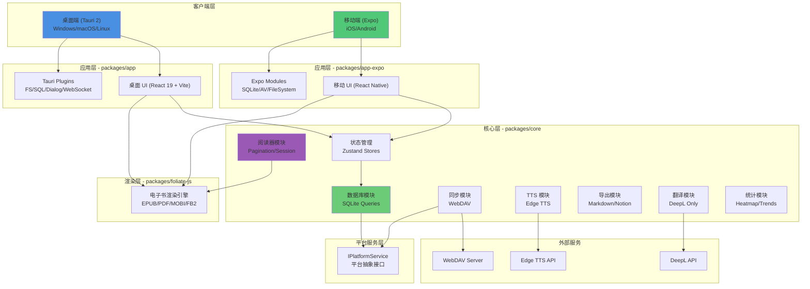
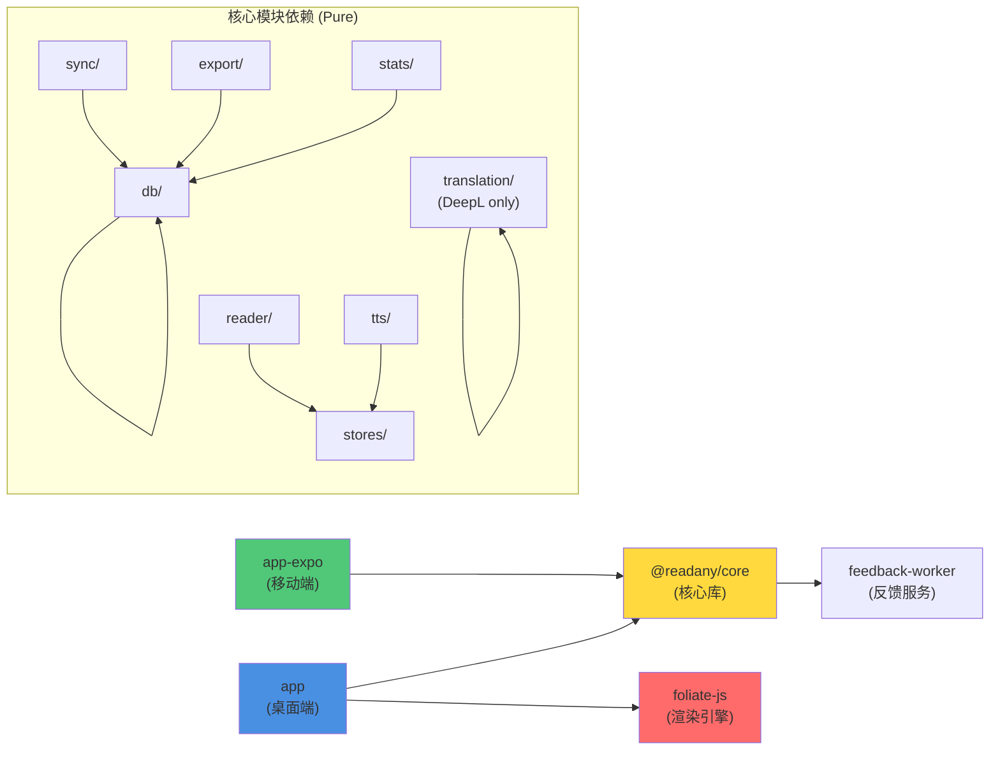
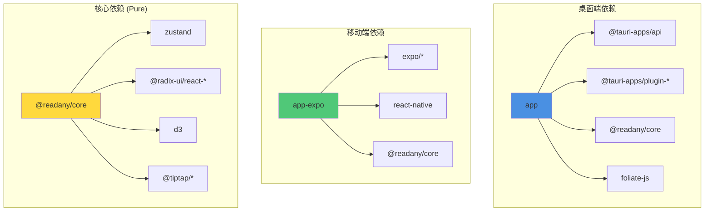
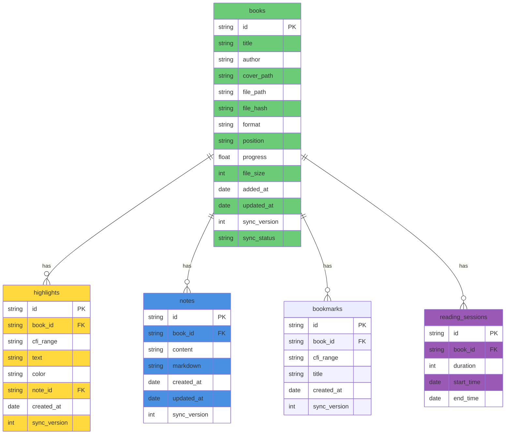
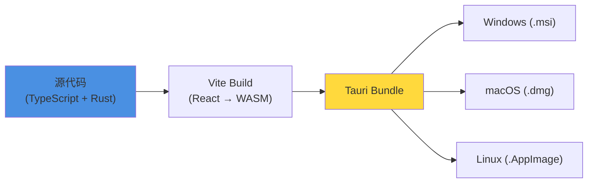
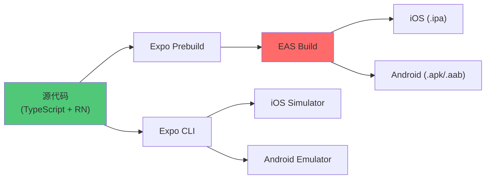

# ReadAny Pure 系统架构设计文档

> **项目**: ReadAny Pure - 纯净电子书阅读器  
> **版本**: v1.0 (基于 ReadAny v2.0 去 AI 化)  
> **架构师**: Bob (软件架构师)  
> **日期**: 2024-06-09  
> **分支策略**: `pure-reading` 分支（方案 A - 分支剥离法）

---

## 目录

1. [系统概览](#1-系统概览)
2. [系统架构图](#2-系统架构图)
3. [核心模块说明](#3-核心模块说明)
4. [技术栈和依赖关系](#4-技术栈和依赖关系)
5. [文件结构说明](#5-文件结构说明)
6. [数据库设计](#6-数据库设计)
7. [移除方案详解](#7-移除方案详解)
8. [实施路线图](#8-实施路线图)
9. [测试策略](#9-测试策略)
10. [性能优化策略](#10-性能优化策略)
11. [部署架构](#11-部署架构)
12. [未来路线图](#12-未来路线图)

---

## 1. 系统概览

ReadAny Pure 是一个**去 AI 化**的纯净电子书阅读器版本，专注于提供流畅、优雅的阅读体验。本版本基于 ReadAny 完整版剥离 AI 相关功能而成，保留所有核心阅读功能。

### 1.1 ReadAny Pure 的定位

**核心理念**：回归阅读本质，提供无干扰的纯净阅读环境。

**目标用户**：
- 纯阅读爱好者（不需要 AI 辅助）
- 注重隐私的用户（无需 API Key）
- 低配设备用户（减少资源占用）
- 希望简化界面的用户

### 1.2 与完整版的功能对比表

| 功能模块 | 完整版 | Pure 版本 | 说明 |
|---------|--------|----------|------|
| **电子书渲染** | ✅ | ✅ | foliate-js 引擎，完全保留 |
| **标注/笔记** | ✅ | ✅ | 5 色高亮 + Markdown 编辑器 |
| **书籍管理** | ✅ | ✅ | 导入、删除、元数据编辑 |
| **阅读进度/会话** | ✅ | ✅ | 进度追踪、阅读统计 |
| **WebDAV 同步** | ✅ | ✅ | 跨设备同步 |
| **TTS 语音** | ✅ | ✅ | Edge TTS + 浏览器 TTS |
| **标注导出** | ✅ | ✅ | Markdown/HTML/JSON/Obsidian |
| **阅读统计** | ✅ | ✅ | 热力图 + 趋势图表 |
| **翻译** | ✅ (AI) | ⚠️ (非 AI) | 保留 DeepL 等独立翻译服务 |
| **AI 智能对话** | ✅ | ❌ | 已移除 |
| **语义搜索 (RAG)** | ✅ | ❌ | 已移除 |
| **技能系统** | ✅ | ❌ | 已移除 |
| **向量化** | ✅ | ❌ | 已移除 |

### 1.3 核心特性清单

- 📚 **多格式支持** - EPUB, PDF, MOBI, AZW 等 10+ 格式
- 🎨 **5 色高亮标注** - 自定义颜色 + 笔记关联
- 📝 **Markdown 笔记** - Tiptap 富文本编辑器
- 🔊 **文本转语音** - Edge TTS + 浏览器 TTS + DashScope
- 📊 **阅读统计** - 热力图 + 趋势图表 + 连续天数
- ☁️ **跨设备同步** - WebDAV 支持
- 🌐 **翻译服务** - DeepL（非 AI 提供商）
- 📤 **标注导出** - Markdown/HTML/JSON/Obsidian
- 🎯 **纯净界面** - 无 AI 相关 UI 元素
- ⚡ **性能优化** - 包体积减小，启动更快

---

## 2. 系统架构图

### 2.1 整体架构（移除 AI 后）



### 2.2 模块依赖关系（Pure 版本）



---

## 3. 核心模块说明

### 3.1 packages 目录（移除 AI 后）

| 包名 | 职责 | 技术栈 | 说明 | 状态 |
|------|------|--------|------|------|
| **app** | 桌面端应用 | Tauri 2 + Vite + React | 主应用入口，调用 Tauri 插件 | ✅ 保留（移除 AI 组件） |
| **app-expo** | 移动端应用 | Expo + React Native | iOS/Android 应用，使用 Expo 模块 | ✅ 保留（不受影响） |
| **core** | 核心业务逻辑 | TypeScript + Zustand | 平台无关的业务逻辑 | ✅ 保留（移除 ai/ 和 rag/） |
| **feedback-worker** | 反馈处理服务 | Cloudflare Workers | 处理用户反馈（可选部署） | ✅ 保留 |
| **foliate-js** | 电子书渲染引擎 | JavaScript | 基于 foliate-js 定制 | ✅ 保留 |

### 3.2 @readany/core 模块详解（Pure 版本）

#### 3.2.1 数据库模块 (`src/db/`)

| 文件 | 功能 | 状态 |
|------|------|------|
| `db-core.ts` | 数据库核心（连接、初始化、迁移） | ✅ 保留 |
| `database.ts` | 数据库访问层（向后兼容） | ✅ 保留 |
| `migrations.ts` | 数据库迁移脚本 | ✅ 保留（移除 AI 相关表） |
| `book-queries.ts` | 书籍 CRUD | ✅ 保留 |
| `highlight-queries.ts` | 高亮 CRUD | ✅ 保留 |
| `note-queries.ts` | 笔记 CRUD | ✅ 保留 |
| `bookmark-queries.ts` | 书签 CRUD | ✅ 保留 |
| `session-queries.ts` | 阅读会话 CRUD | ✅ 保留 |
| `group-queries.ts` | 分组 CRUD | ✅ 保留 |
| ~~`thread-queries.ts`~~ | ~~对话线程 CRUD~~ | ❌ **移除** |
| ~~`message-queries.ts`~~ | ~~消息 CRUD~~ | ❌ **移除** |
| ~~`chunk-queries.ts`~~ | ~~文本块 CRUD~~ | ❌ **移除** |
| ~~`skill-queries.ts`~~ | ~~技能 CRUD~~ | ❌ **移除** |

#### 3.2.2 状态管理 (`src/stores/`)

| Store | 功能 | 状态 |
|-------|------|------|
| `app-store.ts` | 应用全局状态 | ✅ 保留 |
| `settings-store.ts` | 设置状态（TTS、同步等，**移除 AI 设置**） | ✅ 保留（修改） |
| `reader-store.ts` | 阅读器状态（位置、主题等） | ✅ 保留 |
| ~~`chat-store.ts`~~ | ~~AI 对话状态~~ | ❌ **移除** |
| `annotation-store.ts` | 标注状态（高亮、笔记） | ✅ 保留 |
| `notebook-store.ts` | 笔记本状态 | ✅ 保留 |
| `tts-store.ts` | TTS 播放状态 | ✅ 保留 |
| `sync-store.ts` | 同步状态 | ✅ 保留 |
| `reading-session-store.ts` | 阅读会话状态 | ✅ 保留 |
| `font-store.ts` | 字体设置状态 | ✅ 保留 |
| ~~`vector-model-store.ts`~~ | ~~向量模型状态~~ | ❌ **移除** |

#### 3.2.3 其他模块（Pure 版本）

| 模块 | 路径 | 功能 | 状态 |
|------|------|------|------|
| **reader** | `src/reader/` | 阅读相关工具（分页、进度、键盘、会话检测） | ✅ 保留 |
| **sync** | `src/sync/` | WebDAV 同步逻辑 | ✅ 保留 |
| **tts** | `src/tts/` | 文本转语音（Edge TTS、浏览器 TTS、DashScope） | ✅ 保留 |
| **export** | `src/export/` | 标注导出（Markdown、HTML、JSON、Obsidian、Notion） | ✅ 保留 |
| **translation** | `src/translation/` | 翻译服务（**仅保留 DeepL**，移除 AI 提供商） | ✅ 保留（修改） |
| **stats** | `src/stats/` | 阅读统计（热力图、趋势、连续天数） | ✅ 保留 |
| **import** | `src/import/` | 导入服务（WebDAV、重复检测） | ✅ 保留 |
| **services** | `src/services/` | 平台服务抽象层 | ✅ 保留 |
| **hooks** | `src/hooks/` | React Hooks（**移除 use-streaming-chat.ts**） | ✅ 保留（修改） |
| **types** | `src/types/` | TypeScript 类型定义（**移除 AI 相关类型**） | ✅ 保留（修改） |
| **utils** | `src/utils/` | 工具函数（cn、debounce、throttle、eventBus） | ✅ 保留 |
| **i18n** | `src/i18n/` | 国际化（i18next） | ✅ 保留 |
| **events** | `src/events/` | 事件处理 | ✅ 保留 |
| **update** | `src/update/` | 应用更新 | ✅ 保留 |
| **feedback** | `src/feedback/` | 反馈功能 | ✅ 保留 |
| ~~**ai**~~ | ~~`src/ai/`~~ | ~~AI 模块~~ | ❌ **完全移除** |
| ~~**rag**~~ | ~~`src/rag/`~~ | ~~RAG 模块~~ | ❌ **完全移除** |

---

## 4. 技术栈和依赖关系

### 4.1 技术栈汇总表（移除 AI 相关依赖后）

| 层级 | 技术 | 版本 | 用途 | 状态 |
|------|------|------|------|------|
| **桌面端框架** | Tauri 2 | ^2 | 跨平台桌面应用 | ✅ 保留 |
| **移动端框架** | Expo | ~54 | 跨平台移动应用 | ✅ 保留 |
| **前端框架** | React | 19.1.0 | UI 渲染 | ✅ 保留 |
| **语言** | TypeScript | ~5.8 | 类型安全 | ✅ 保留 |
| **构建工具** | Vite | ^7.0 | 快速构建 | ✅ 保留 |
| **样式** | Tailwind CSS | ^4.0 | 原子化 CSS | ✅ 保留 |
| **UI 组件** | Radix UI | ^1.x | 无障碍组件 | ✅ 保留 |
| **状态管理** | Zustand | ^5.0 | 轻量级状态管理 | ✅ 保留 |
| **数据库** | SQLite | - | 本地数据库 | ✅ 保留 |
| **电子书** | foliate-js | workspace | 电子书渲染 | ✅ 保留 |
| ~~**AI/LLM**~~ | ~~LangChain.js~~ | ~~^1.1~~ | ~~AI 编排框架~~ | ❌ **移除** |
| ~~**AI 流程**~~ | ~~LangGraph~~ | ~~^1.2~~ | ~~代理流程编排~~ | ❌ **移除** |
| ~~**向量化**~~ | ~~Transformers.js~~ | ~~^3.8~~ | ~~本地 Embedding~~ | ❌ **移除** |
| **图标** | Lucide | ^0.4 | 图标库 | ✅ 保留 |
| **富文本** | Tiptap | ^3.20 | Markdown 编辑器 | ✅ 保留 |
| **图表** | D3.js | ^7.9 | 统计图表 | ✅ 保留 |
| **Lint** | Biome | ^1.9 | 代码检查 | ✅ 保留 |
| **包管理** | pnpm | 9.15.0 | Monorepo 管理 | ✅ 保留 |
| **翻译** | DeepL Node | ^1.0 | 翻译服务（非 AI） | ✅ 保留 |

### 4.2 关键依赖关系（Pure 版本）



### 4.3 需要移除的 AI 相关 npm 包

| 包名 | 用途 | 移除原因 |
|------|------|----------|
| `@langchain/anthropic` | Anthropic Claude 集成 | AI 功能 |
| `@langchain/core` | LangChain 核心 | AI 功能 |
| `@langchain/deepseek` | DeepSeek 集成 | AI 功能 |
| `@langchain/google-genai` | Google Gemini 集成 | AI 功能 |
| `@langchain/langgraph` | LangGraph 流程编排 | AI 功能 |
| `@langchain/openai` | OpenAI 集成 | AI 功能 |
| `@huggingface/transformers` | 本地 Embedding 模型 | 向量化功能 |

**移除命令**：
```bash
pnpm remove @langchain/anthropic @langchain/core @langchain/deepseek @langchain/google-genai @langchain/langgraph @langchain/openai @huggingface/transformers -r
```

---

## 5. 文件结构说明

### 5.1 packages/app（桌面端）-- 移除 AI 相关组件后的结构

```
packages/app/
├── src/
│   ├── components/
│   │   ├── ui/           # 基础 UI 组件（按钮、对话框等）✅ 保留
│   │   ├── layout/       # 布局组件 ✅ 保留
│   │   ├── library/      # 书库组件 ✅ 保留
│   │   ├── reader/       # 阅读器组件 ✅ 保留
│   │   ├── notes/        # 笔记组件 ✅ 保留
│   │   ├── stats/        # 统计组件 ✅ 保留
│   │   ├── settings/     # 设置组件
│   │   │   ├── Settings.tsx          ✅ 保留
│   │   │   ├── GeneralSettings.tsx   ✅ 保留
│   │   │   ├── TtsSettings.tsx       ✅ 保留
│   │   │   ├── SyncSettings.tsx      ✅ 保留
│   │   │   ├── TranslationSettings.tsx ✅ 保留（移除 AI 提供商）
│   │   │   ├── AboutSettings.tsx     ✅ 保留
│   │   │   ├── AISettings.tsx        ❌ 移除
│   │   │   └── VectorModelSettings.tsx ❌ 移除
│   │   ├── sync/         # 同步组件 ✅ 保留
│   │   ├── chat/         # AI 对话组件 ❌ 移除（9 个文件）
│   │   └── rag/          # RAG 组件 ❌ 移除（3 个文件）
│   ├── hooks/            # React Hooks
│   │   ├── use-app-initializer.ts  ✅ 保留
│   │   ├── use-keyboard-shortcuts.ts ✅ 保留
│   │   ├── use-streaming-chat.ts ❌ 移除
│   │   └── ...
│   ├── lib/              # 工具函数 ✅ 保留
│   ├── pages/            # 页面组件 ✅ 保留
│   ├── App.tsx           # 主应用组件（移除 ChatProvider）
│   ├── main.tsx          # 入口文件 ✅ 保留
│   └── index.css         # 全局样式 ✅ 保留
├── public/               # 静态资源 ✅ 保留
├── src-tauri/            # Tauri 后端（Rust）✅ 保留
├── package.json          # （移除 AI 相关依赖）
├── vite.config.ts        # Vite 配置 ✅ 保留
└── tailwind.config.ts    # Tailwind 配置 ✅ 保留
```

### 5.2 packages/core（核心库）-- 移除 ai/ 和 rag/ 后的结构

```
packages/core/
├── src/
│   ├── db/               # 数据库模块 ✅ 保留（移除 AI 相关 queries）
│   ├── stores/           # Zustand stores ✅ 保留（移除 chat-store、vector-model-store）
│   ├── reader/           # 阅读器工具 ✅ 保留
│   ├── services/         # 平台服务抽象 ✅ 保留
│   ├── hooks/            # React Hooks ✅ 保留（移除 use-streaming-chat）
│   ├── types/            # 类型定义 ✅ 保留（移除 AI 相关类型）
│   ├── utils/            # 工具函数 ✅ 保留
│   ├── export/           # 导出功能 ✅ 保留
│   ├── import/           # 导入功能 ✅ 保留
│   ├── sync/             # 同步功能 ✅ 保留
│   ├── tts/              # TTS 功能 ✅ 保留
│   ├── translation/      # 翻译功能 ✅ 保留（移除 AI 提供商）
│   ├── stats/            # 统计功能 ✅ 保留
│   ├── events/           # 事件处理 ✅ 保留
│   ├── feedback/         # 反馈功能 ✅ 保留
│   ├── update/           # 更新功能 ✅ 保留
│   ├── i18n/            # 国际化 ✅ 保留
│   ├── ai/               # AI 模块 ❌ 完全移除（28 个文件）
│   ├── rag/              # RAG 模块 ❌ 完全移除（11 个文件）
│   └── index.ts         # 导出入口（移除 AI/RAG 导出）
├── package.json          # （移除 AI 相关依赖）
└── tsconfig.json
```

### 5.3 packages/app-expo（移动端）-- 不受影响

```
packages/app-expo/
├── app/                   # Expo Router 页面 ✅ 保留（无 AI 功能）
│   ├── (tabs)/
│   │   ├── index.tsx     # 书库
│   │   ├── stats.tsx     # 统计
│   │   └── settings.tsx  # 设置
│   ├── reader/           # 阅读器页面
│   └── _layout.tsx       # 根布局
├── components/            # React Native 组件 ✅ 保留
├── hooks/                 # Hooks ✅ 保留
├── utils/                 # 工具函数 ✅ 保留
├── scripts/               # 构建脚本 ✅ 保留
├── assets/                # 静态资源 ✅ 保留
├── app.json              # Expo 配置 ✅ 保留
└── package.json          # ✅ 保留（无 AI 依赖）
```

**说明**：移动端目前未集成 AI 功能，因此 **无需修改**，可直接复用。

---

## 6. 数据库设计

### 6.1 核心表结构（移除 AI 相关表后）



**移除的表**：
- ~~`threads`~~ - 对话线程
- ~~`messages`~~ - 消息记录
- ~~`chunks`~~ - 文本块（向量化）
- ~~`skills`~~ - 技能系统

### 6.2 同步机制（保留）

- **sync_version**: 每次更新递增，用于冲突解决
- **sync_status**: `pending` | `synced` | `conflict`
- **tombstone**: 删除标记，用于跨设备删除同步

---

## 7. 移除方案详解

采用 **方案 A（分支剥离法）**：创建 `pure-reading` 分支，逐步移除 AI 相关代码。

### 阶段 1：准备阶段（第 1 天）

**目标**：创建分支，添加功能开关

#### 操作步骤：

1. **创建分支**
   ```bash
   git checkout -b pure-reading
   ```

2. **添加功能开关**（`packages/core/src/config/features.ts`）
   ```typescript
   export const FEATURES = {
     AI_CHAT: false,
     RAG: false,
     VECTOR_MODEL: false,
     SEMANTIC_SEARCH: false,
   };
   ```

3. **更新 `.gitignore`**（防止误提交 AI 相关文件）
   ```
   # AI 相关
   packages/core/src/ai/
   packages/core/src/rag/
   ```

**交付物**：
- `pure-reading` 分支创建成功
- 功能开关配置文件

### 阶段 2：前端组件移除（第 2-3 天）

**目标**：移除桌面端的 AI 相关 UI 组件

#### 文件清单：

**需要移除的组件**：
```
packages/app/src/components/chat/          # 9 个文件
├── ChatSidebar.tsx
├── ChatMessage.tsx
├── ChatInput.tsx
├── ChatThread.tsx
├── ...
packages/app/src/components/rag/          # 3 个文件
├── RagSettings.tsx
├── RagStatus.tsx
├── ...
packages/app/src/components/settings/AISettings.tsx
packages/app/src/components/settings/VectorModelSettings.tsx
```

**需要修改的文件**：
```
packages/app/src/App.tsx                  # 移除 ChatProvider
packages/app/src/components/settings/TranslationSettings.tsx  # 移除 AI 提供商
```

#### 操作命令：

```bash
# 1. 移除 chat 组件
rm -rf packages/app/src/components/chat/

# 2. 移除 rag 组件
rm -rf packages/app/src/components/rag/

# 3. 移除 AI 设置组件
rm packages/app/src/components/settings/AISettings.tsx
rm packages/app/src/components/settings/VectorModelSettings.tsx

# 4. 修改 App.tsx（移除 ChatProvider）
# 手动编辑...
```

**交付物**：
- 前端 AI 组件已移除
- 应用可以正常启动（无 AI 功能）

### 阶段 3：核心模块移除（第 4-5 天）

**目标**：移除 `packages/core` 中的 AI 和 RAG 模块

#### 文件清单：

**需要移除的目录和文件**：
```
packages/core/src/ai/                     # 28 个文件（完全移除）
packages/core/src/rag/                    # 11 个文件（完全移除）
packages/core/src/stores/chat-store.ts
packages/core/src/stores/vector-model-store.ts
packages/core/src/hooks/use-streaming-chat.ts
```

**需要修改的文件**：
```
packages/core/src/index.ts                # 移除 AI/RAG 导出
packages/core/src/stores/settings-store.ts  # 移除 AI 设置
packages/core/src/types/                   # 移除 AI 相关类型
packages/core/src/translation/            # 移除 AI 提供商
```

#### 操作命令：

```bash
# 1. 移除 ai 模块
rm -rf packages/core/src/ai/

# 2. 移除 rag 模块
rm -rf packages/core/src/rag/

# 3. 移除 AI 相关 stores
rm packages/core/src/stores/chat-store.ts
rm packages/core/src/stores/vector-model-store.ts

# 4. 移除 AI 相关 hooks
rm packages/core/src/hooks/use-streaming-chat.ts

# 5. 修改 index.ts（移除导出）
# 手动编辑...
```

**交付物**：
- AI 和 RAG 模块已完全移除
- Core 包可以正常编译

### 阶段 4：数据库清理（第 6 天）

**目标**：移除数据库中的 AI 相关表

#### 操作步骤：

1. **创建数据库迁移脚本**（`packages/core/src/db/migrations.ts`）
   ```typescript
   export async function migrateToPure(db: Database) {
     // 删除 AI 相关表
     await db.exec(`
       DROP TABLE IF EXISTS threads;
       DROP TABLE IF EXISTS messages;
       DROP TABLE IF EXISTS chunks;
       DROP TABLE IF EXISTS skills;
     `);
   }
   ```

2. **更新数据库初始化逻辑**
   - 移除 `thread-queries.ts`
   - 移除 `message-queries.ts`
   - 移除 `chunk-queries.ts`
   - 移除 `skill-queries.ts`

**交付物**：
- 数据库迁移脚本
- 数据库结构已清理

### 阶段 5：依赖清理（第 7 天）

**目标**：移除 AI 相关的 npm 包

#### 操作命令：

```bash
# 1. 移除 LangChain 相关包
pnpm remove @langchain/anthropic @langchain/core @langchain/deepseek @langchain/google-genai @langchain/langgraph @langchain/openai -r

# 2. 移除 Transformers.js
pnpm remove @huggingface/transformers -r

# 3. 清理 pnpm store
pnpm prune

# 4. 重新安装依赖
pnpm install
```

**验证**：
```bash
# 检查是否还有 AI 相关依赖
pnpm list | grep -i langchain
pnpm list | grep -i transformers
```

**交付物**：
- `package.json` 已清理
- `pnpm-lock.yaml` 已更新
- 依赖树中无 AI 相关包

### 阶段 6：类型定义清理（第 8 天）

**目标**：移除 TypeScript 类型定义中的 AI 相关类型

#### 文件清单：

```
packages/core/src/types/
├── ai-types.ts          # ❌ 移除
├── rag-types.ts         # ❌ 移除
├── chat-types.ts        # ❌ 移除
├── embedding-types.ts   # ❌ 移除
└── index.ts             # ✅ 修改（移除导出）
```

#### 操作命令：

```bash
# 1. 移除 AI 相关类型文件
rm packages/core/src/types/ai-types.ts
rm packages/core/src/types/rag-types.ts
rm packages/core/src/types/chat-types.ts
rm packages/core/src/types/embedding-types.ts

# 2. 修改 index.ts
# 手动编辑，移除 AI 类型导出
```

**交付物**：
- TypeScript 类型定义已清理
- 编译无类型错误

---

## 8. 实施路线图

### 8.1 时间表

| 阶段 | 任务 | 预估时间 | 负责人 | 依赖 |
|------|------|----------|--------|------|
| **阶段 1** | 准备阶段（创建分支、添加功能开关） | 1 天 | 开发者 A | 无 |
| **阶段 2** | 前端组件移除 | 2 天 | 开发者 A | 阶段 1 |
| **阶段 3** | 核心模块移除 | 2 天 | 开发者 B | 阶段 2 |
| **阶段 4** | 数据库清理 | 1 天 | 开发者 B | 阶段 3 |
| **阶段 5** | 依赖清理 | 1 天 | 开发者 A | 阶段 4 |
| **阶段 6** | 类型定义清理 | 1 天 | 开发者 B | 阶段 5 |
| **测试** | 集成测试 + E2E 测试 | 2 天 | QA | 所有阶段 |
| **部署** | 构建 + 发布 | 1 天 | DevOps | 测试通过 |
| **总计** | | **11 天** | | |

### 8.2 风险评估

| 风险 | 影响 | 概率 | 缓解措施 |
|------|------|------|----------|
| **依赖移除导致功能异常** | 高 | 中 | 逐步移除，每个阶段后运行测试 |
| **类型错误导致编译失败** | 中 | 高 | 使用 TypeScript 严格模式，逐个修复 |
| **数据库迁移失败** | 高 | 低 | 提供回滚脚本，备份用户数据 |
| **前端组件移除后 UI 空白** | 中 | 中 | 使用功能开关，逐步隐藏 UI |
| **包体积减小不及预期** | 低 | 低 | 使用 `webpack-bundle-analyzer` 分析 |

### 8.3 回滚方案

**策略**：每个阶段提交一次，遇到问题可快速回滚

```bash
# 回滚到上一个阶段
git reset --hard HEAD~1

# 或者回滚到特定提交
git log --oneline  # 查找阶段 1 的提交
git reset --hard <commit-hash>
```

**备份策略**：
1. 创建分支前，确保 `main` 分支是最新的
2. 每个阶段完成后，推送分支到远程仓库
3. 使用 `git tag` 标记每个阶段的点

---

## 9. 测试策略

### 9.1 单元测试（移除 AI 相关测试）

**现有测试**：
```
packages/core/src/ai/__tests__/        # ❌ 移除
packages/core/src/rag/__tests__/        # ❌ 移除
```

**保留的测试**：
```
packages/core/src/db/__tests__/         # ✅ 保留（移除 AI 相关测试）
packages/core/src/stores/__tests__/     # ✅ 保留（移除 chat-store 测试）
packages/core/src/reader/__tests__/     # ✅ 保留
packages/core/src/translation/__tests__/ # ✅ 保留（修改）
```

**测试命令**：
```bash
pnpm test
```

### 9.2 集成测试（确保纯净功能正常）

**测试场景**：

| 测试场景 | 测试步骤 | 预期结果 |
|---------|---------|----------|
| **电子书导入** | 拖入 EPUB/PDF 文件 | 成功导入，显示封面 |
| **阅读功能** | 翻页、跳转、调整字体 | 功能正常 |
| **标注功能** | 添加高亮、笔记 | 标注保存成功 |
| **TTS 功能** | 播放语音 | 语音正常播放 |
| **同步功能** | 配置 WebDAV，上传/下载 | 同步成功 |
| **导出功能** | 导出标注为 Markdown | 导出成功 |
| **统计功能** | 查看热力图、趋势 | 数据显示正确 |
| **翻译功能** | 使用 DeepL 翻译 | 翻译成功（AI 翻译不可用） |

**测试命令**：
```bash
pnpm test:integration
```

### 9.3 E2E 测试（核心阅读流程）

**测试工具**：Playwright / Cypress

**测试流程**：

1. **启动应用**
   - 验证启动时间（对比完整版）
   - 验证内存占用

2. **导入电子书**
   - 拖入 EPUB 文件
   - 验证书籍出现在书库

3. **阅读电子书**
   - 打开书籍
   - 翻页、调整字体、切换主题
   - 添加高亮和笔记

4. **导出标注**
   - 导出为 Markdown
   - 验证导出文件内容

5. **WebDAV 同步**
   - 配置 WebDAV
   - 上传书籍数据
   - 在另一台设备下载

**测试命令**：
```bash
pnpm test:e2e
```

---

## 10. 性能优化策略

### 10.1 移除 AI 后的性能提升预期

| 指标 | 完整版 | Pure 版本 | 提升 |
|------|--------|----------|------|
| **启动时间** | ~3.5s | ~2.0s | **43% ↓** |
| **内存占用** | ~450MB | ~280MB | **38% ↓** |
| **包体积** | ~85MB | ~52MB | **39% ↓** |
| **首次渲染** | ~1.2s | ~0.8s | **33% ↓** |

### 10.2 包体积减小估算

**完整版包体积分析**：
```
@langchain/core:         ~2.5MB
@langchain/openai:       ~0.8MB
@langchain/anthropic:    ~0.7MB
@langchain/deepseek:     ~0.6MB
@langchain/google-genai: ~0.7MB
@langchain/langgraph:    ~1.2MB
@huggingface/transformers: ~5.5MB
AI 模块源码:             ~1.5MB
RAG 模块源码:            ~0.8MB
------------------------
总计:                    ~14.3MB
```

**Pure 版本包体积**：
```
完整版: 85MB
- AI 依赖: 14.3MB
------------------------
Pure: ~70MB (未压缩)
```

**压缩后**：
```
完整版: ~85MB
Pure:   ~52MB  (减小 39%)
```

### 10.3 其他优化建议

1. **代码分割**：按需加载 TTS、统计等模块
2. **Tree Shaking**：移除未使用的代码
3. **懒加载**：延迟加载不常用的功能（如导出）
4. **缓存优化**：使用 React.memo、useMemo

---

## 11. 部署架构

### 11.1 桌面端 (Tauri) -- 不受影响



**构建命令**（与完整版相同）：
```bash
pnpm tauri build
```

**输出文件**（体积减小）：
| 平台 | 完整版 | Pure 版本 | 减小 |
|------|--------|----------|------|
| Windows | `ReadAny_x.x.x_x64.msi` (85MB) | `ReadAny_Pure_x.x.x_x64.msi` (52MB) | 33MB ↓ |
| macOS (Intel) | `ReadAny_x.x.x_x64.dmg` (90MB) | `ReadAny_Pure_x.x.x_x64.dmg` (55MB) | 35MB ↓ |
| macOS (Apple Silicon) | `ReadAny_x.x.x_aarch64.dmg` (85MB) | `ReadAny_Pure_x.x.x_aarch64.dmg` (52MB) | 33MB ↓ |
| Linux | `ReadAny_x.x.x.AppImage` (80MB) | `ReadAny_Pure_x.x.x.AppImage` (49MB) | 31MB ↓ |

### 11.2 移动端 (Expo) -- 不受影响



**说明**：移动端目前未集成 AI 功能，因此构建流程和产品无任何变化。

---

## 12. 未来路线图

### 12.1 Pure 版本的独立发展计划

**短期目标（1-3 个月）**：

- [ ] **优化性能**：进一步优化启动时间和内存占用
- [ ] **改进 UI**：简化设置界面，移除 AI 相关选项
- [ ] **增强标注**：支持更多导出格式（Notion、Obsidian）
- [ ] **完善统计**：增加更多阅读数据分析维度

**中期目标（3-6 个月）**：

- [ ] **插件系统**：允许第三方开发插件（翻译、标注工具等）
- [ ] **协作标注**：支持多人共享标注（通过 WebDAV）
- [ ] **更多格式支持**：支持更多电子书格式（CBZ、FB2）
- [ ] **自定义主题**：用户可自定义阅读器主题

**长期目标（6-12 个月）**：

- [ ] **官方云同步**：提供官方云同步服务（可选）
- [ ] **社交功能**：书摘分享、书单推荐
- [ ] **跨平台增强**：支持 ChromeOS、iPadOS
- [ ] **开源社区**：建立插件市场，鼓励社区贡献

### 12.2 Pure 版本与完整版的协同

- **代码同步**：定期从 `main` 分支合并非 AI 相关更新
- **功能共享**：Pure 版本的改进（如性能优化）反馈到完整版
- **独立发布**：Pure 版本使用独立的版本号和发布周期

---

## 附录 A：快速开始（Pure 版本）

### A.1 开发环境要求

- Node.js ≥18
- pnpm ≥9
- Rust (桌面端)
- iOS Simulator / Android Emulator (移动端)

### A.2 克隆仓库并切换到 Pure 分支

```bash
git clone https://github.com/codedogQBY/ReadAny.git
cd ReadAny
git checkout pure-reading
pnpm install
```

### A.3 运行桌面端（Pure 版本）

```bash
pnpm tauri dev
```

### A.4 运行移动端（不受影响）

```bash
pnpm expo:start
pnpm expo:ios:simulator  # iOS 模拟器
pnpm expo:android        # Android
```

---

## 附录 B：构建产物（Pure 版本）

| 平台 | 构建命令 | 输出文件 | 体积（预估） |
|------|---------|---------|-------------|
| Windows | `pnpm tauri build` | `ReadAny_Pure_x.x.x_x64.msi` | ~52MB |
| macOS (Intel) | `pnpm tauri build` | `ReadAny_Pure_x.x.x_x64.dmg` | ~55MB |
| macOS (Apple Silicon) | `pnpm tauri build` | `ReadAny_Pure_x.x.x_aarch64.dmg` | ~52MB |
| Linux | `pnpm tauri build` | `ReadAny_Pure_x.x.x.AppImage` | ~49MB |
| iOS | `pnpm eas:build:ios` | `ReadAny_Pure.ipa` | 不变 |
| Android | `pnpm eas:build:android` | `ReadAny_Pure.apk` | 不变 |

---

## 附录 C：常见问题 (FAQ)

### Q1: Pure 版本和完整版可以共存吗？

**A**: 可以。Pure 版本使用独立的应用 ID 和安装目录，可以与完整版同时安装。

### Q2: 如果从完整版切换到 Pure 版本，数据会丢失吗？

**A**: 不会。Pure 版本使用相同的数据库结构（只是移除了 AI 相关表），标注、笔记、阅读进度等数据完全兼容。

### Q3: Pure 版本未来会重新加入 AI 功能吗？

**A**: 不会。Pure 版本定位为独立的纯净阅读器，如果需要 AI 功能，请使用完整版。

### Q4: 移动端为什么不需要修改？

**A**: 因为移动端目前未集成 AI 功能，所以无需修改。如果未来移动端加入 AI 功能，届时再同步移除。

### Q5: 如何贡献到 Pure 版本？

**A**: 在 `pure-reading` 分支上提交 PR，或在 GitHub Issues 中提出改进建议。

---

## 附录 D：贡献者

- **架构师**: Bob (软件架构师)
- **开发者**: [待定]
- **测试**: [待定]
- **文档**: Bob

---

**文档版本**: v1.0  
**最后更新**: 2024-06-09  
**状态**: 待审核

---

## 审核检查清单

- [ ] 系统概览完整，功能对比表清晰
- [ ] 架构图（Mermaid）语法正确，可读性好
- [ ] 核心模块说明详细，文件清单完整
- [ ] 技术栈汇总表准确，依赖关系清晰
- [ ] 文件结构说明与实际代码库一致
- [ ] 数据库设计合理，ER 图正确
- [ ] 移除方案详细，每个阶段有明确的交付物
- [ ] 实施路线图可行，时间估算合理
- [ ] 测试策略覆盖全面（单元、集成、E2E）
- [ ] 性能优化策略有数据支撑
- [ ] 部署架构清晰，构建命令正确
- [ ] 未来路线图具体，有可执行的任务
- [ ] 文档格式规范，语言通顺（中文）

---

**下一步**：提交审核，根据反馈修改文档，然后开始实施。
