# ReadAny 系统架构设计文档

> **项目**: ReadAny - AI 赋能的电子书阅读器  
> **版本**: v2.0  
> **架构师**: 高见远 (Bob)  
> **日期**: 2024-06-09

---

## 目录

1. [系统概览](#1-系统概览)
2. [系统架构图](#2-系统架构图)
3. [核心模块说明](#3-核心模块说明)
4. [技术栈和依赖关系](#4-技术栈和依赖关系)
5. [数据流设计](#5-数据流设计)
6. [文件结构说明](#6-文件结构说明)
7. [数据库设计](#7-数据库设计)
8. [AI 架构设计](#8-ai-架构设计)

---

## 1. 系统概览

ReadAny 是一个 AI 赋能的电子书阅读器，支持语义搜索、智能对话和知识管理。项目采用 **pnpm monorepo** 架构，实现桌面端和移动端代码共享。

### 核心特性

- 🤖 **AI 智能对话** - 基于 LangChain.js 的多模型支持
- 🔍 **语义搜索 (RAG)** - 本地向量存储 + 混合检索
- 📝 **标注与笔记** - 5 色高亮 + Markdown 编辑器
- 🔊 **文本转语音 (TTS)** - Edge TTS + 浏览器 TTS
- 📊 **阅读统计** - 热力图 + 趋势图表
- ☁️ **跨设备同步** - WebDAV 支持
- 🌐 **多格式支持** - EPUB, PDF, MOBI, AZW 等 10+ 格式

---

## 2. 系统架构图

### 2.1 整体架构

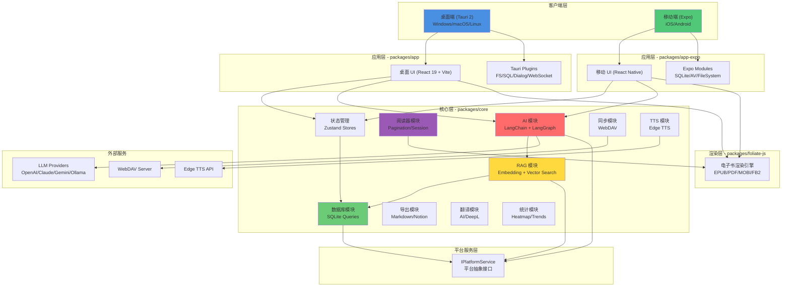

### 2.2 模块依赖关系

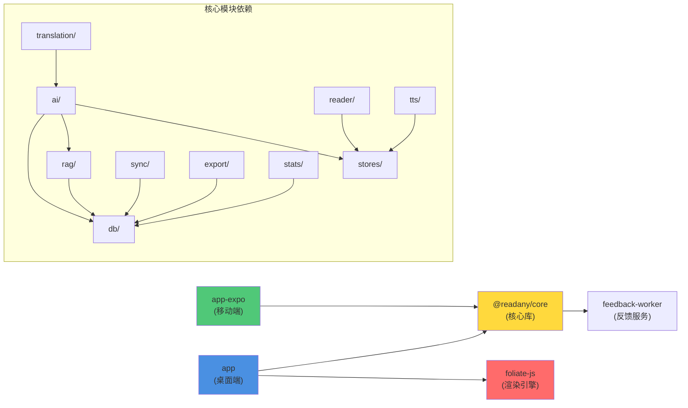

---

## 3. 核心模块说明

### 3.1 packages 目录

| 包名 | 职责 | 技术栈 | 说明 |
|------|------|--------|------|
| **app** | 桌面端应用 | Tauri 2 + Vite + React | 主应用入口，调用 Tauri 插件 |
| **app-expo** | 移动端应用 | Expo + React Native | iOS/Android 应用，使用 Expo 模块 |
| **core** | 核心业务逻辑 | TypeScript + Zustand | 平台无关的业务逻辑，供桌面端和移动端共享 |
| **feedback-worker** | 反馈处理服务 | Cloudflare Workers | 处理用户反馈（可选部署） |
| **foliate-js** | 电子书渲染引擎 | JavaScript | 基于 foliate-js 定制，支持多种格式 |

### 3.2 @readany/core 模块详解

#### 3.2.1 AI 模块 (`src/ai/`)

| 文件 | 功能 |
|------|------|
| `reading-agent.ts` | 阅读代理，协调 AI 对话 |
| `llm-provider.ts` | LLM 提供商抽象（OpenAI/Claude/Gemini/Ollama） |
| `chat-memory.ts` | 对话记忆管理 |
| `reading-context-service.ts` | 阅读上下文服务（当前位置、选中文本、高亮） |
| `semantic-context.ts` | 语义上下文构建 |
| `message-pipeline.ts` | 消息处理管道 |
| `streaming.ts` | 流式响应处理 |
| `system-prompt.ts` | 系统提示词构建 |
| **skills/** | 技能系统（内置 + 自定义） |
| **tools/** | AI 工具集（标注、RAG、思维导图等） |
| **agents/** | AI 代理实现 |

#### 3.2.2 RAG 模块 (`src/rag/`)

| 文件 | 功能 |
|------|------|
| `chunker.ts` | 文本分块策略 |
| `embedding-service.ts` | 向量化服务 |
| `embedding.ts` | Embedding 模型接口 |
| `vectorize.ts` | 向量化流程 |
| `vectorize-trigger.ts` | 自动向量化触发器 |
| `search.ts` | 混合搜索（向量 + BM25） |
| `inverted-index.ts` | 倒排索引（BM25） |
| `tokenizer.ts` | 分词器 |
| `vector-db.ts` | 向量数据库接口 |

#### 3.2.3 数据库模块 (`src/db/`)

| 文件 | 功能 |
|------|------|
| `db-core.ts` | 数据库核心（连接、初始化、迁移） |
| `database.ts` | 数据库访问层（向后兼容） |
| `migrations.ts` | 数据库迁移脚本 |
| `book-queries.ts` | 书籍 CRUD |
| `highlight-queries.ts` | 高亮 CRUD |
| `note-queries.ts` | 笔记 CRUD |
| `bookmark-queries.ts` | 书签 CRUD |
| `thread-queries.ts` | 对话线程 CRUD |
| `message-queries.ts` | 消息 CRUD |
| `chunk-queries.ts` | 文本块 CRUD |
| `skill-queries.ts` | 技能 CRUD |
| `session-queries.ts` | 阅读会话 CRUD |
| `group-queries.ts` | 分组 CRUD |

#### 3.2.4 状态管理 (`src/stores/`)

| Store | 功能 |
|-------|------|
| `app-store.ts` | 应用全局状态 |
| `settings-store.ts` | 设置状态（AI、TTS、同步等） |
| `reader-store.ts` | 阅读器状态（位置、主题等） |
| `chat-store.ts` | AI 对话状态 |
| `annotation-store.ts` | 标注状态（高亮、笔记） |
| `notebook-store.ts` | 笔记本状态 |
| `tts-store.ts` | TTS 播放状态 |
| `sync-store.ts` | 同步状态 |
| `reading-session-store.ts` | 阅读会话状态 |
| `font-store.ts` | 字体设置状态 |
| `vector-model-store.ts` | 向量模型状态 |

#### 3.2.5 其他模块

| 模块 | 路径 | 功能 |
|------|------|------|
| **reader** | `src/reader/` | 阅读相关工具（分页、进度、键盘、会话检测） |
| **sync** | `src/sync/` | WebDAV 同步逻辑 |
| **tts** | `src/tts/` | 文本转语音（Edge TTS、浏览器 TTS、DashScope） |
| **export** | `src/export/` | 标注导出（Markdown、HTML、JSON、Obsidian、Notion） |
| **translation** | `src/translation/` | 翻译服务（AI、DeepL） |
| **stats** | `src/stats/` | 阅读统计（热力图、趋势、连续天数） |
| **import** | `src/import/` | 导入服务（WebDAV、重复检测） |
| **services** | `src/services/` | 平台服务抽象层 |
| **hooks** | `src/hooks/` | React Hooks |
| **types** | `src/types/` | TypeScript 类型定义 |
| **utils** | `src/utils/` | 工具函数（cn、debounce、throttle、eventBus） |
| **i18n** | `src/i18n/` | 国际化（i18next） |
| **events** | `src/events/` | 事件处理 |
| **update** | `src/update/` | 应用更新 |
| **feedback** | `src/feedback/` | 反馈功能 |

---

## 4. 技术栈和依赖关系

### 4.1 技术栈汇总

| 层级 | 技术 | 版本 | 用途 |
|------|------|------|------|
| **桌面端框架** | Tauri 2 | ^2 | 跨平台桌面应用 |
| **移动端框架** | Expo | ~54 | 跨平台移动应用 |
| **前端框架** | React | 19.1.0 | UI 渲染 |
| **语言** | TypeScript | ~5.8 | 类型安全 |
| **构建工具** | Vite | ^7.0 | 快速构建 |
| **样式** | Tailwind CSS | ^4.0 | 原子化 CSS |
| **UI 组件** | Radix UI | ^1.x | 无障碍组件 |
| **状态管理** | Zustand | ^5.0 | 轻量级状态管理 |
| **数据库** | SQLite | - | 本地数据库 |
| **电子书** | foliate-js | workspace | 电子书渲染 |
| **AI/LLM** | LangChain.js | ^1.1 | AI 编排框架 |
| **AI 流程** | LangGraph | ^1.2 | 代理流程编排 |
| **向量化** | Transformers.js | ^3.8 | 本地 Embedding |
| **图标** | Lucide | ^0.4 | 图标库 |
| **富文本** | Tiptap | ^3.20 | Markdown 编辑器 |
| **图表** | D3.js | ^7.9 | 统计图表 |
| **Lint** | Biome | ^1.9 | 代码检查 |
| **包管理** | pnpm | 9.15.0 | Monorepo 管理 |

### 4.2 关键依赖关系

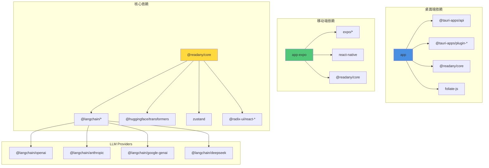

---

## 5. 数据流设计

### 5.1 AI 对话数据流

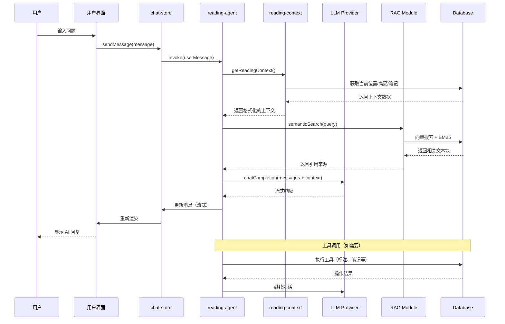

### 5.2 电子书导入数据流

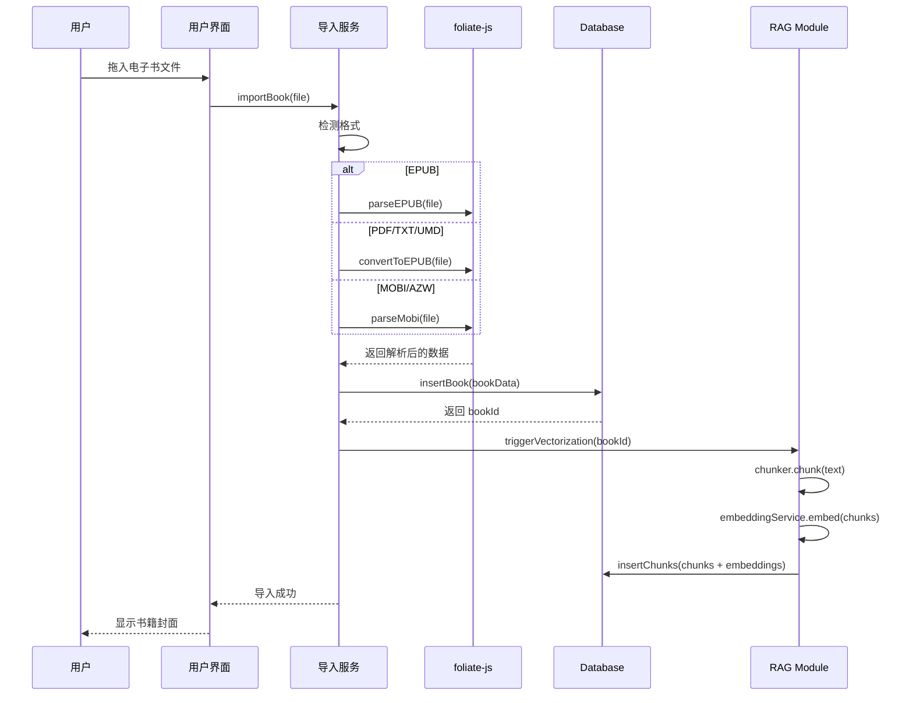

### 5.3 阅读位置同步数据流

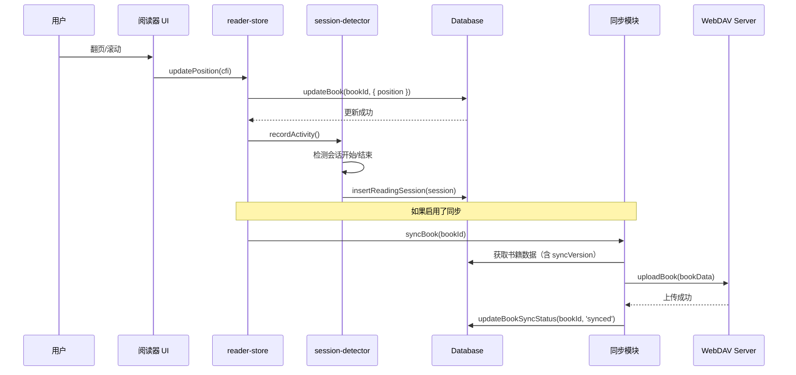

---

## 6. 文件结构说明

### 6.1 根目录

```
ReadAny/
├── packages/              # Monorepo 包
├── website/               # 官方网站（文档）
├── docs/                  # 项目文档
├── scripts/               # 构建/版本脚本
├── patches/               # pnpm patches
├── assets/                # 静态资源（截图等）
├── .github/               # GitHub Actions
├── package.json           # 根 package.json
├── pnpm-workspace.yaml    # pnpm 工作区配置
├── tsconfig.json          # TypeScript 配置
├── biome.json             # Biome 配置
├── eas.json               # EAS Build 配置
├── README.md              # 英文文档
└── README_CN.md           # 中文文档
```

### 6.2 packages/app（桌面端）

```
packages/app/
├── src/
│   ├── components/        # React 组件
│   │   ├── ui/           # 基础 UI 组件（按钮、对话框等）
│   │   ├── layout/       # 布局组件
│   │   ├── library/      # 书库组件
│   │   ├── reader/       # 阅读器组件
│   │   ├── chat/         # AI 对话组件
│   │   ├── notes/        # 笔记组件
│   │   ├── stats/        # 统计组件
│   │   ├── settings/     # 设置组件
│   │   └── sync/         # 同步组件
│   ├── hooks/            # React Hooks
│   ├── lib/              # 工具函数
│   ├── pages/            # 页面组件
│   ├── App.tsx           # 主应用组件
│   ├── main.tsx          # 入口文件
│   └── index.css         # 全局样式
├── public/               # 静态资源
├── src-tauri/            # Tauri 后端（Rust）
├── package.json
├── vite.config.ts        # Vite 配置
└── tailwind.config.ts    # Tailwind 配置
```

### 6.3 packages/core（核心库）

```
packages/core/
├── src/
│   ├── ai/               # AI 模块
│   │   ├── agents/       # AI 代理
│   │   ├── tools/        # AI 工具
│   │   ├── skills/       # 技能系统
│   │   └── __tests__/    # 测试
│   ├── rag/              # RAG 模块
│   ├── db/               # 数据库模块
│   ├── stores/           # Zustand stores
│   ├── reader/           # 阅读器工具
│   ├── services/         # 平台服务抽象
│   ├── hooks/            # React Hooks
│   ├── types/            # 类型定义
│   ├── utils/            # 工具函数
│   ├── export/           # 导出功能
│   ├── import/           # 导入功能
│   ├── sync/             # 同步功能
│   ├── tts/              # TTS 功能
│   ├── translation/      # 翻译功能
│   ├── stats/            # 统计功能
│   ├── events/           # 事件处理
│   ├── feedback/         # 反馈功能
│   ├── update/           # 更新功能
│   ├── i18n/            # 国际化
│   └── index.ts         # 导出入口
├── package.json
└── tsconfig.json
```

### 6.4 packages/app-expo（移动端）

```
packages/app-expo/
├── app/                   # Expo Router 页面
│   ├── (tabs)/           # Tab 页面
│   │   ├── index.tsx     # 书库
│   │   ├── stats.tsx     # 统计
│   │   └── settings.tsx  # 设置
│   ├── reader/           # 阅读器页面
│   └── _layout.tsx       # 根布局
├── components/            # React Native 组件
├── hooks/                 # Hooks
├── utils/                 # 工具函数
├── scripts/               # 构建脚本
├── assets/                # 静态资源
├── app.json              # Expo 配置
└── package.json
```

---

## 7. 数据库设计

### 7.1 核心表结构

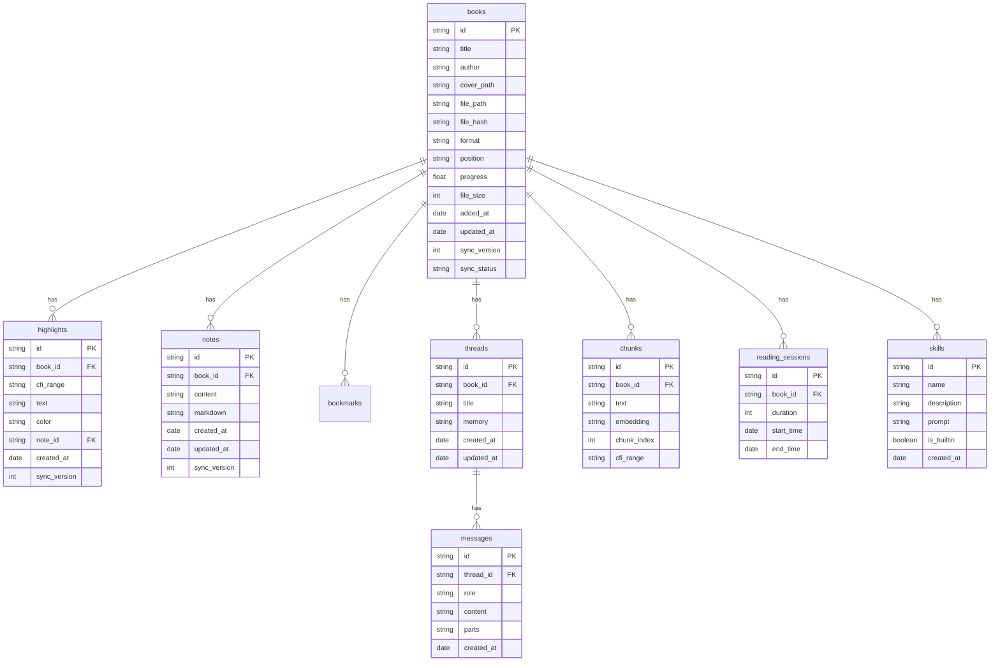

### 7.2 同步机制

- **sync_version**: 每次更新递增，用于冲突解决
- **sync_status**: `pending` | `synced` | `conflict`
- **tombstone**: 删除标记，用于跨设备删除同步

---

## 8. AI 架构设计

### 8.1 LLM 提供商支持

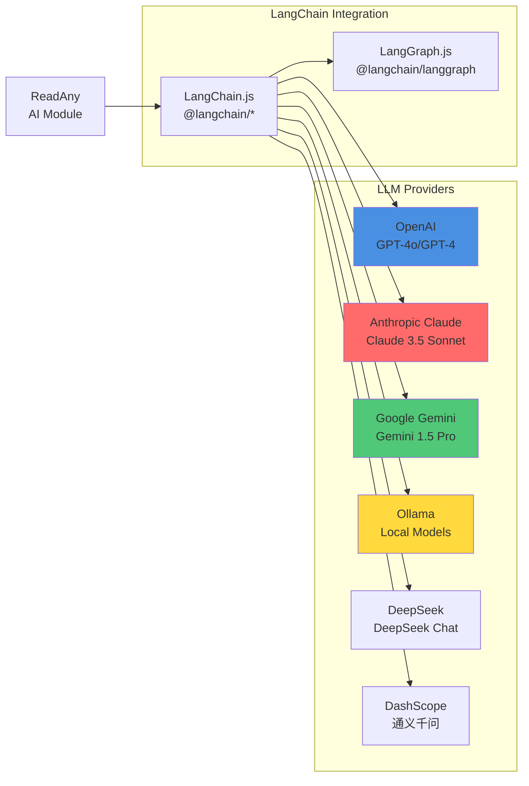

### 8.2 技能系统 (Skills)

| 内置技能 | 功能 |
|---------|------|
| **summarizer** | 章节/全书摘要 |
| **concept-explainer** | 概念解释 |
| **character-tracker** | 人物关系追踪 |
| **translator** | 即时翻译 |
| **mindmap-generator** | 思维导图生成 |
| **quiz-generator** | 知识测验生成 |

用户可自定义技能，通过 Prompt 模板实现。

### 8.3 RAG 流程

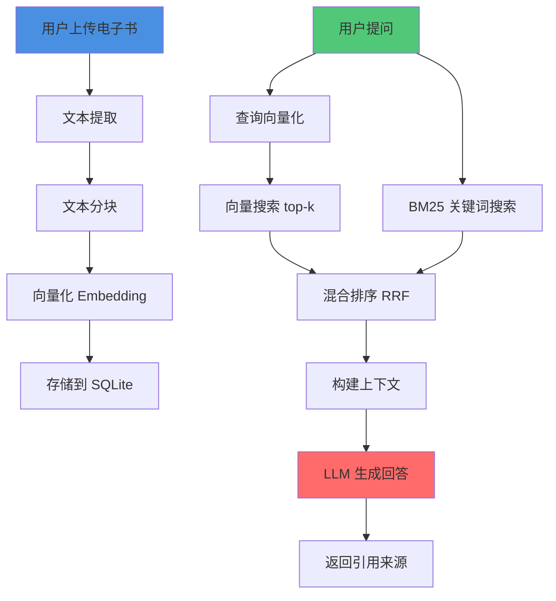

#### 向量化模型

- **本地**: `Xenova/all-MiniLM-L6-v2` (Transformers.js)
- **远程**: OpenAI `text-embedding-3-small`, Cohere, Jina

---

## 9. 部署架构

### 9.1 桌面端 (Tauri)

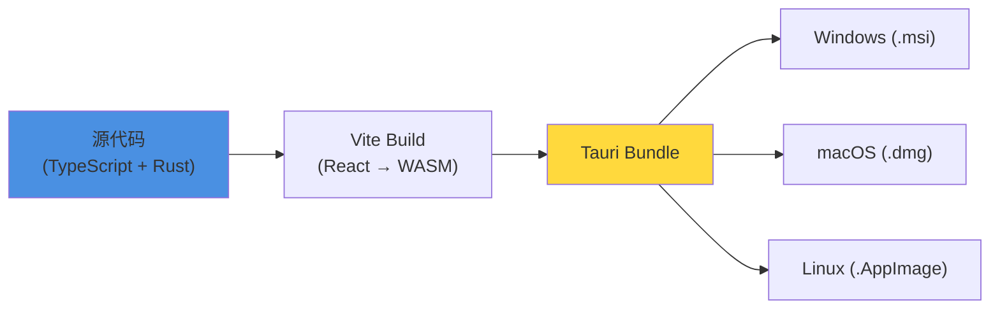

### 9.2 移动端 (Expo)

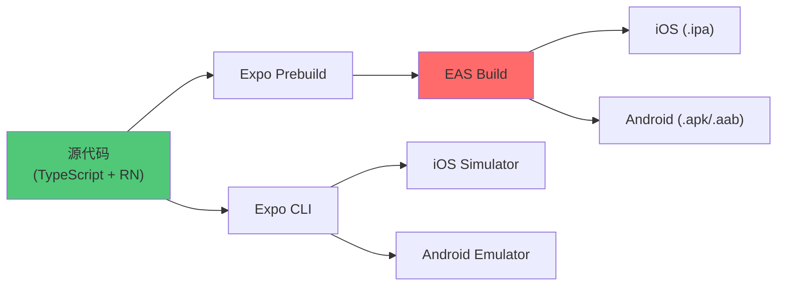

---

## 10. 性能优化策略

| 策略 | 实现 | 效果 |
|------|------|------|
| **虚拟列表** | react-window | 大书库流畅滚动 |
| **代码分割** | Vite dynamic import | 按需加载组件 |
| **Web Worker** | embedding-worker.ts | 向量化不阻塞 UI |
| **防抖/节流** | utils/debounce.ts | 输入优化 |
| **本地向量化** | Transformers.js | 离线 AI 功能 |
| **数据库索引** | SQLite indexes | 快速查询 |
| **混合搜索** | 向量 + BM25 | 精准召回 |

---

## 11. 安全设计

| 方面 | 措施 |
|------|------|
| **API Key 存储** | Tauri: Keychain, Expo: SecureStore |
| **本地数据** | SQLite 本地存储，不强制上云 |
| **WebDAV 密码** | 加密存储 |
| **LLM 调用** | 用户自带 API Key，不中转 |
| **开源协议** | GPL-3.0，代码完全透明 |

---

## 12. 未来路线图

- [ ] 更多 AI 模型（Qwen、GLM、Llama）
- [ ] PDF 重排/重新渲染
- [ ] 插件系统
- [ ] 官方云同步服务
- [ ] 协作标注
- [ ] 社交功能（书摘分享）

---

## 附录 A：快速开始

### 开发环境要求

- Node.js ≥18
- pnpm ≥9
- Rust (桌面端)
- iOS Simulator / Android Emulator (移动端)

### 安装依赖

```bash
git clone https://github.com/codedogQBY/ReadAny.git
cd ReadAny
pnpm install
```

### 运行桌面端

```bash
pnpm tauri dev
```

### 运行移动端

```bash
pnpm expo:start
pnpm expo:ios:simulator  # iOS 模拟器
pnpm expo:android        # Android
```

---

## 附录 B：构建产物

| 平台 | 构建命令 | 输出文件 |
|------|---------|---------|
| Windows | `pnpm tauri build` | `ReadAny_x.x.x_x64.msi` |
| macOS (Intel) | `pnpm tauri build` | `ReadAny_x.x.x_x64.dmg` |
| macOS (Apple Silicon) | `pnpm tauri build` | `ReadAny_x.x.x_aarch64.dmg` |
| Linux | `pnpm tauri build` | `ReadAny_x.x.x.AppImage` |
| iOS | `pnpm eas:build:ios` | `ReadAny.ipa` |
| Android | `pnpm eas:build:android` | `ReadAny.apk` |

---

**文档版本**: v1.0  
**最后更新**: 2024-06-09  
**架构师**: 高见远 (Bob)
